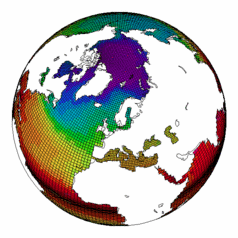

FAST as Ferret Analysis Scripting Toolbox

FAST is a library to facilitate post-processing and visualization with Ferret.

FAST is a collection of Ferret scripts and K-shell scripts. Its purpose is to hide a certain number of low-level and repetitive commands which can transform your Ferret scripts in long and unclear programs. With the scripts provided here you will more easilly control and set pages, viewports, texts, legends, colorbars, logos, ratios, zooms and also produce polygon maps and vectors maps.

Ferret is a very powerfull application developped by the PMEL. I strongly recommand to read first the documentation and the tutorial they provide from their web site http://www.ferret.noaa.gov/Ferret/.
